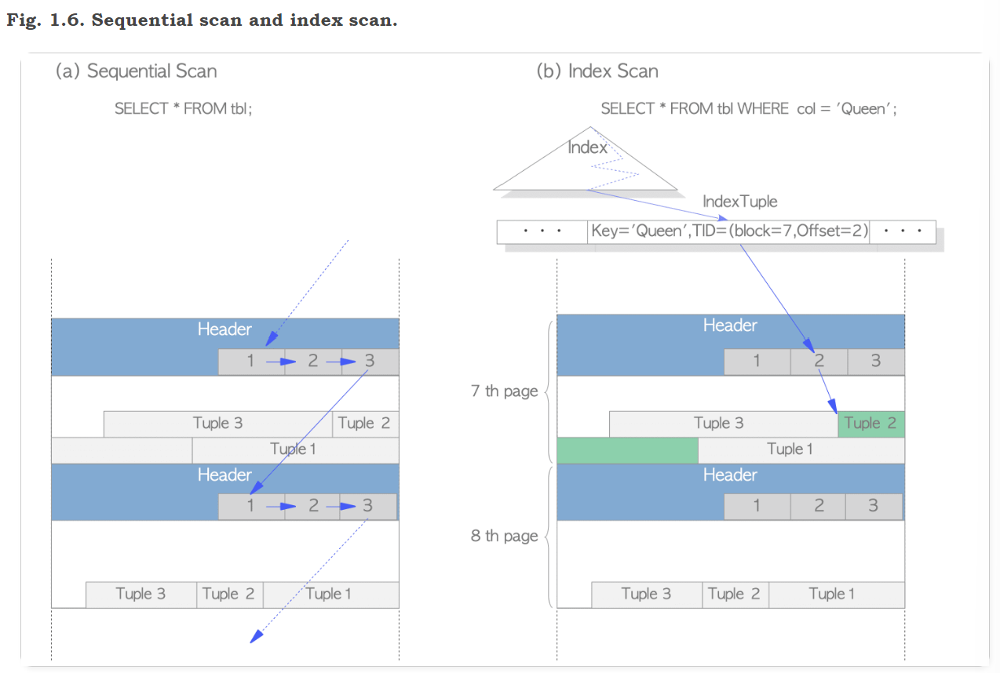

# Chapter1 Database Cluster, Databases and Tables

- The logical structure of a database cluster
- The physical structure of a database cluster
- The internal layout of a heap table file
- The methods of writing and reading data to a table

## 1.1 Logical Structure of Database Cluster

对于Pg而言，数据库是一系列数据库对象的集合，数据库对象指的是用于存储或指向数据的数据结构，比如表，索引，视图等。数据库本身也是数据对象。

一个数据库集合（cluster）包含多个数据库，由一个pg server统一管理。


所有的数据对象都由OIDs(object identifiers)唯一标识，根据不同的对象类型存储在catalog中。比如数据库的oid存储在pg_database中，而表，索引等的oid存储在pg_class中。


## 1.2. Physical Structure of Database Cluster

一个数据库集群对应一个基目录，而initdb命令可以在指定目录下新建一个数据库集群；这个目录通常在PGDATA下，但也不是强制的。

> pg_ctl -D ~/imdb initdb

如下图，我们指定目录新建了一个集群，由于pg独特的用户权限管理模式，这个数据库集群由ubuntu中的用户拥有，如果这个用户没有pg server的权限，这个集群是无法启动的。在创建时，自动设置了比如buffer大小等配置信息。进入testDB目录后可以看到很多配置文件。


查看PGDATA在哪：


只有postgres用户可以进入该目录


集群的目录结构如下所示，每个数据库存储在base目录下，以oid作为子目录名：


### 1.2.1. Layout of a Database Cluster

**table 1.1: Layout of files and subdirectories under the base directory (From the official document)**

| files                | description                                                  |
| :------------------- | :----------------------------------------------------------- |
| PG_VERSION           | A file containing the major version number of PostgreSQL     |
| pg_hba.conf          | A file to control PosgreSQL's client authentication          |
| pg_ident.conf        | A file to control PostgreSQL's user name mapping             |
| postgresql.conf      | A file to set configuration parameters                       |
| postgresql.auto.conf | A file used for storing configuration parameters that are set in ALTER SYSTEM (version 9.4 or later) |
| postmaster.opts      | A file recording the command line options the server was last started with |

| subdirectories                    | description                                                  |
| :-------------------------------- | :----------------------------------------------------------- |
| base/                             | Subdirectory containing per-database subdirectories.         |
| global/                           | Subdirectory containing cluster-wide tables, such as pg_database and pg_control. |
| pg_commit_ts/                     | Subdirectory containing transaction commit timestamp data. Version 9.5 or later. |
| pg_clog/ (Version 9.6 or earlier) | Subdirectory containing transaction commit state data. It is renamed to *pg_xact* in Version 10. CLOG will be described in [Section 5.4](https://www.interdb.jp/pg/pgsql05.html#_5.4.). |
| pg_dynshmem/                      | Subdirectory containing files used by the dynamic shared memory subsystem. Version 9.4 or later. |
| pg_logical/                       | Subdirectory containing status data for logical decoding. Version 9.4 or later. |
| pg_multixact/                     | Subdirectory containing multitransaction status data (used for shared row locks) |
| pg_notify/                        | Subdirectory containing LISTEN/NOTIFY status data            |
| pg_repslot/                       | Subdirectory containing [replication slot](http://www.postgresql.org/docs/current/static/warm-standby.html#STREAMING-REPLICATION-SLOTS) data. Version 9.4 or later. |
| pg_serial/                        | Subdirectory containing information about committed serializable transactions (version 9.1 or later) |
| pg_snapshots/                     | Subdirectory containing exported snapshots (version 9.2 or later). The PostgreSQL's function pg_export_snapshot creates a snapshot information file in this subdirectory. |
| pg_stat/                          | Subdirectory containing permanent files for the statistics subsystem. |
| pg_stat_tmp/                      | Subdirectory containing temporary files for the statistics subsystem. |
| pg_subtrans/                      | Subdirectory containing subtransaction status data           |
| pg_tblspc/                        | Subdirectory containing symbolic links to tablespaces        |
| pg_twophase/                      | Subdirectory containing state files for prepared transactions |
| pg_wal/ (Version 10 or later)     | Subdirectory containing WAL (Write Ahead Logging) segment files. It is renamed from *pg_xlog* in Version 10. |
| pg_xact/ (Version 10 or later)    | Subdirectory containing transaction commit state data. It is renamed from *pg_clog* in Version 10. CLOG will be described in [Section 5.4](https://www.interdb.jp/pg/pgsql05.html#_5.4.). |
| pg_xlog/ (Version 9.6 or earlier) | Subdirectory containing WAL (Write Ahead Logging) segment files. It is renamed to *pg_wal* in Version 10. |

### 1.2.2. Layout of Databases

一个数据库就是base文件夹下的一个子文件夹，文件夹名为数据库的OID

### 1.2.3. Layout of Files Associated with Tables and Indexes

数据库下每个表或者索引（大小小于1GB）时以单独文件存储在对应的数据库文件夹下（base文件夹下），以表的OID标识；通常这些数据文件由relfilenode管理。表的OID和relfilenode一般情况下是一致的，除非表发生了改动（TRUNCATE, REINDEX）。

如下图，imdb数据库的OID是16384，表name_basics的OID是16385，和其relfilenode一致。


表对应的relfilenode会在一些命令执行后发生改变，比如TRUNCATE, REINDEX, CLUSTER等。这些操作会删除原有的数据文件并重新分配一个。

还可以通过一下方式查找表数据存储位置：


如果表数据超过1GB（这个最大值可以配置），会新增relfilenode.1,.2以此类推，比如下图


在数据文件夹下可以看到每个表有两个关联文件_fsm和__vm，他们分别对应的是**free space map** 和 **visibility map**，存储表的剩余空间大小以及页的可视信息。索引只有**free space map** 一项。


### 1.2.4. Tablespaces

Tablespaces自8.0版本引入


A tablespace is created under the directory specified when you issue [CREATE TABLESPACE](http://www.postgresql.org/docs/current/static/sql-createtablespace.html) statement, and under that directory, the version-specific subdirectory (e.g., PG_14_202011044) will be created. The naming method for version-specific one is shown below.

```sh
PG _ 'Major version' _ 'Catalogue version number'
```

For example, if you create a tablespace *'new_tblspc'* at *'/home/postgres/tblspc'*, whose oid is 16386, a subdirectory such as *'PG_14_202011044'* would be created under the tablespace.

```sh
$ ls -l /home/postgres/tblspc/
total 4
drwx------ 2 postgres postgres 4096 Apr 21 10:08 PG_14_202011044
```

The tablespace directory is addressed by a symbolic link from the *pg_tblspc* subdirectory, and the link name is the same as the OID value of tablespace.

```shell
$ ls -l $PGDATA/pg_tblspc/
total 0
lrwxrwxrwx 1 postgres postgres 21 Apr 21 10:08 16386 -> /home/postgres/tblspc
```

If you create a new database (OID is 16387) under the tablespace, its directory is created under the version-specific subdirectory.

```shell
$ ls -l /home/postgres/tblspc/PG_14_202011044/
total 4
drwx------ 2 postgres postgres 4096 Apr 21 10:10 16387
```

If you create a new table which belongs to the database created under the base directory, first, the new directory, whose name is the same as the existing database OID, is created under the version specific subdirectory, and then the new table file is placed under the created directory.

```sql
sampledb=# CREATE TABLE newtbl (.....) TABLESPACE new_tblspc;

sampledb=# SELECT pg_relation_filepath('newtbl');
             pg_relation_filepath             
---------------------------------------------
 pg_tblspc/16386/PG_14_202011044/16384/18894
```

## 1.3. Internal Layout of a Heap Table File

数据文件是分页（块）的，页面大小默认值为8KB。页面可以由索引或者堆组织，本节只介绍堆组织。

如下图所示，页面包含三种数据：

1. heap tuple(s)：真正的数据存储，从页面**尾部**开始存放
2. line pointer(s)：4字节的指针，指向对应的heap tuple，也称为item pointer。标号从1开始组成一个指针数组，标号也称为offset number，每当新元组插入页面时，新的line pointer也添加进该数组。
3. header data：包含页面相关信息
   - *pd_lsn* – This variable stores the LSN of XLOG record written by the last change of this page. It is an 8-byte unsigned integer, related to the WAL (Write-Ahead Logging) mechanism. The details are described in [Chapter 9](https://www.interdb.jp/pg/pgsql09.html#_9.1.2.).
   - *pd_checksum* – This variable stores the checksum value of this page. (Note that this variable is supported in version 9.3 or later; in earlier versions, this part had stored the timelineId of the page.)
   - *pd_lower, pd_upper* – pd_lower points to **the end of line pointers**, and pd_upper to **the beginning of the newest heap tuple**.
   - *pd_special* – This variable is for indexes. In the page within tables, it points to the end of the page. (In the page within indexes, it points to the beginning of special space which is the data area held only by indexes and contains the particular data according to the kind of index types such as B-tree, GiST, GiN, etc.)


唯一确定一个tuple：TID, 由block number确定页，再由offset number确定指向元组的line poiner。

上图这种类型的页称为slotted page，line pointer称为slot array

## 1.4. The Methods of Writing and Reading Tuples

### 1.4.1. Writing Heap Tuples

Suppose a table composed of one page which contains just one heap tuple. The pd_lower of this page points to the first line pointer, and both the line pointer and the pd_upper point to the first heap tuple. See Fig. 1.5(a).

When the second tuple is inserted, it is placed after the first one. The second line pointer is pushed onto the first one, and it points to the second tuple. The pd_lower changes to point to the second line pointer, and the pd_upper to the second heap tuple. See Fig. 1.5(b). Other header data within this page (e.g., pd_lsn, pg_checksum, pg_flag) are also rewritten to appropriate values; more details are described in [Section 5.3](https://www.interdb.jp/pg/pgsql05.html#_5.3.) and [Chapter 9](https://www.interdb.jp/pg/pgsql09.html).


### 1.4.2. Reading Heap Tuples

对Mysql而言，表是由主键（聚集）索引组织的，最终回到主键索引读取数据；而PG的索引类似Mysql中的二级索引，只负责搜索工作，叶子结点存储的value是TID，最终回到heap file中读取元组。

Two typical access methods, sequential scan and B-tree index scan, are outlined here:

- **Sequential scan** – All tuples in all pages are sequentially read by scanning all line pointers in each page. See Fig. 1.6(a).
- **B-tree index scan** – An index file contains index tuples, each of which is composed of **an index key and a TID pointing to the target heap tuple**. If the index tuple with the key that you are looking for has been found, PostgreSQL reads the desired heap tuple using the obtained TID value. (The description of the way to find the index tuples in B-tree index is not explained here as it is very common and the space here is limited. See the relevant materials.) For example, in Fig. 1.6(b), TID value of the obtained index tuple is ‘(block = 7, Offset = 2)’. It means that the target heap tuple is 2nd tuple in the 7th page within the table, so PostgreSQL can read the desired heap tuple without unnecessary scanning in the pages.

