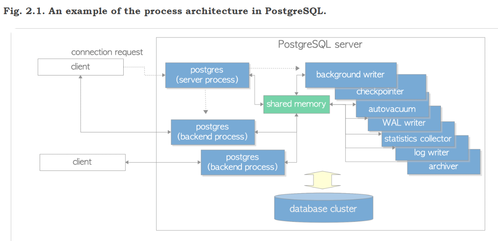
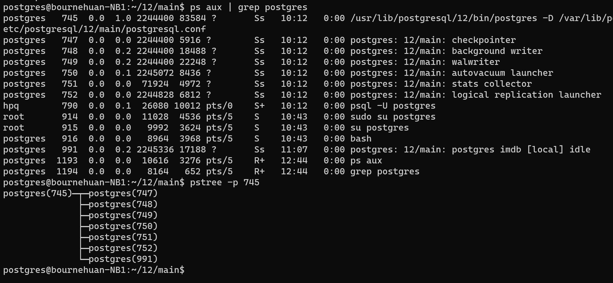
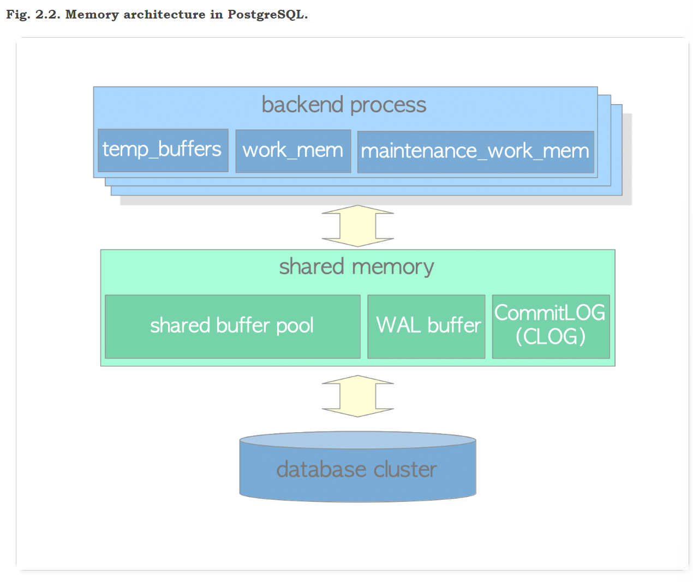

# Chapter 2  Process and Memory Architecture

## 2.1. Process Architecture

PG是多进程，C/S架构，一个Postgresql Server管理一个数据库集合，该server由多进程组成：

- A **postgres server process** is a parent of all processes related to a database cluster management.
- Each **backend process** handles all queries and statements issued by a connected client.
- Various **background processes** perform processes of each feature (e.g., VACUUM and CHECKPOINT processes) for database management.
- In the **replication associated processes**, they perform the streaming replication. The details are described in [Chapter 11](https://www.interdb.jp/pg/pgsql11.html).
- In the **background worker process** supported from version 9.3, it can perform any processing implemented by users. As not going into detail here, refer to the [official document](http://www.postgresql.org/docs/current/static/bgworker.html).

下面介绍三类进程：

### 2.1.1. Postgres Server Process

又被称为postmaster，当使用pg_ctl start命令后，该进程启动。启动后，在内存申请shared memory，然后启动各类background process，等待客户端的连接。客户端连接后，启动backend process来处理客户端请求。

该进程默认监听5432端口，然而一台主机上可能有多个server运行，因此不同的server必须监听不同的端口，这可以通过修改pg配置文件达到。

### 2.1.2. Backend Processes

又称为postgres，由postmaster启动，负责处理client的请求。

该线程只能处理一个数据库，因此在连接到server时必须指定数据库

如果client频繁的连接和断连，server不断地需要创建该线程造成性能下降，一般通过连接池来弥补。

### 2.1.3. Background Processes

| process                    | description                                                  | reference                                                    |
| :------------------------- | :----------------------------------------------------------- | :----------------------------------------------------------- |
| background writer          | In this process, dirty pages on the shared buffer pool are written to a persistent storage (e.g., HDD, SSD) on a **regular basis gradually**. (In version 9.1 or earlier, it was also responsible for checkpoint process.) | [Section 8.6](https://www.interdb.jp/pg/pgsql08.html#_8.6.)  |
| checkpointer               | In this process in version 9.2 or later, checkpoint process is performed. | [Section 8.6](https://www.interdb.jp/pg/pgsql08.html#_8.6.), [Section 9.7](https://www.interdb.jp/pg/pgsql09.html#_9.7.) |
| autovacuum launcher        | The autovacuum-worker processes are invoked for vacuum process periodically. (More precisely, it requests to create the autovacuum workers to the postgres server.) | [Section 6.5](https://www.interdb.jp/pg/pgsql06.html#_6.5.)  |
| WAL writer                 | This process writes and flushes periodically the WAL data on the WAL buffer to persistent storage. | [Section 9.9](https://www.interdb.jp/pg/pgsql09.html#_9.9.)  |
| statistics collector       | In this process, statistics information such as for pg_stat_activity and for pg_stat_database, etc. is collected. |                                                              |
| logging collector (logger) | This process writes error messages into log files.           |                                                              |
| archiver                   | In this process, archiving logging is executed.              | [Section 9.10](https://www.interdb.jp/pg/pgsql09.html#_9.10.) |

如下图，PostgreSQL主进程的PID为745，其下子进程包括一个backend process(PID = 991)以及6个background process，PID从747-752。

## 2.2. Memory Architecture

Memory architecture in PostgreSQL can be classified into two broad categories:

- Local memory area – allocated by each backend process for its own use.
- Shared memory area – used by all processes of a PostgreSQL server.

### 2.2.1. Local Memory Area

Each backend process allocates a local memory area for query processing; each area is divided into several sub-areas – whose sizes are either fixed or variable. Table 2.2 shows a list of the major sub-areas. The details will be described in the following chapters.

| sub-area             | description                                                  | reference                                                   |
| :------------------- | :----------------------------------------------------------- | :---------------------------------------------------------- |
| work_mem             | Executor uses this area for sorting tuples by ORDER BY and DISTINCT operations, and for joining tables by merge-join and hash-join operations. | [Chapter 3](https://www.interdb.jp/pg/pgsql03.html)         |
| maintenance_work_mem | Some kinds of maintenance operations (e.g., VACUUM, REINDEX) use this area. | [Section 6.1](https://www.interdb.jp/pg/pgsql06.html#_6.1.) |
| temp_buffers         | Executor uses this area for storing temporary tables.        |                                                             |

### 2.2.2. Shared Memory Area

A shared memory area is allocated by a PostgreSQL server when it starts up. This area is also divided into several fix sized sub-areas. Table 2.3 shows a list of the major sub-areas. The details will be described in the following chapters.

| sub-area           | description                                                  | reference                                                   |
| :----------------- | :----------------------------------------------------------- | :---------------------------------------------------------- |
| shared buffer pool | PostgreSQL loads pages within tables and indexes from a persistent storage to here, and operates them directly. | [Chapter 8](https://www.interdb.jp/pg/pgsql08.html)         |
| WAL buffer         | To ensure that no data has been lost by server failures, PostgreSQL supports the WAL mechanism. WAL data (also referred to as XLOG records) are transaction log in PostgreSQL; and WAL buffer is a buffering area of the WAL data before writing to a persistent storage. | [Chapter 9](https://www.interdb.jp/pg/pgsql09.html)         |
| commit log         | Commit Log(CLOG) keeps the states of all transactions (e.g., in_progress,committed,aborted) for Concurrency Control (CC) mechanism. | [Section 5.4](https://www.interdb.jp/pg/pgsql05.html#_5.4.) |

In addition to them, PostgreSQL allocates several areas as shown below:

- Sub-areas for the various access control mechanisms. (e.g., semaphores, lightweight locks, shared and exclusive locks, etc)
- Sub-areas for the various background processes, such as checkpointer and autovacuum.
- Sub-areas for transaction processing such as save-point and two-phase-commit.

and others.

