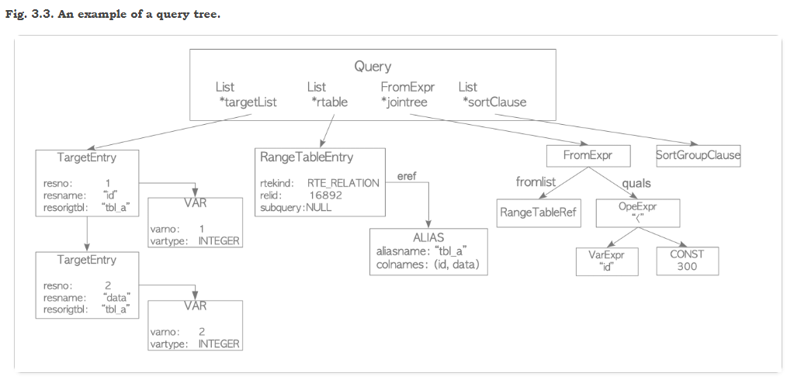

# Chapter 3  Query Processing

## 3.1. Overview

1. Parser
2. The parser generates a parse tree from an SQL statement in plain text.

3. Analyzer/Analyser
4. The analyzer/analyser carries out a semantic analysis of a parse tree and generates a query tree.

5. Rewriter
6. The rewriter transforms a query tree using the rules stored in the [rule system](http://www.postgresql.org/docs/current/static/rules.html) if such rules exist.

7. Planner
8. The planner generates the plan tree that can most effectively be executed from the query tree.

9. Executor
10. The executor executes the query via accessing the tables and indexes in the order that was created by the plan tree.


### 3.1.1. Parser

输入sql，进行词法分析

输出的解析树root节点是SelectStmt类型


定义在文件：https://github.com/postgres/postgres/blob/master/src/include/nodes/parsenodes.h中

```c++
typedef struct SelectStmt
{
	NodeTag		type;
/*
 * These fields are used only in "leaf" SelectStmts.
 */
List	   *distinctClause; /* NULL, list of DISTINCT ON exprs, or
							 * lcons(NIL,NIL) for all (SELECT DISTINCT) */
IntoClause *intoClause;		/* target for SELECT INTO */
List	   *targetList;		/* the target list (of ResTarget) */
List	   *fromClause;		/* the FROM clause */
Node	   *whereClause;	/* WHERE qualification */
List	   *groupClause;	/* GROUP BY clauses */
bool		groupDistinct;	/* Is this GROUP BY DISTINCT? */
Node	   *havingClause;	/* HAVING conditional-expression */
List	   *windowClause;	/* WINDOW window_name AS (...), ... */

/*
 * In a "leaf" node representing a VALUES list, the above fields are all
 * null, and instead this field is set.  Note that the elements of the
 * sublists are just expressions, without ResTarget decoration. Also note
 * that a list element can be DEFAULT (represented as a SetToDefault
 * node), regardless of the context of the VALUES list. It's up to parse
 * analysis to reject that where not valid.
 */
List	   *valuesLists;	/* untransformed list of expression lists */

/*
 * These fields are used in both "leaf" SelectStmts and upper-level
 * SelectStmts.
 */
List	   *sortClause;		/* sort clause (a list of SortBy's) */
Node	   *limitOffset;	/* # of result tuples to skip */
Node	   *limitCount;		/* # of result tuples to return */
LimitOption limitOption;	/* limit type */
List	   *lockingClause;	/* FOR UPDATE (list of LockingClause's) */
WithClause *withClause;		/* WITH clause */

/*
 * These fields are used only in upper-level SelectStmts.
 */
SetOperation op;			/* type of set op */
bool		all;			/* ALL specified? */
struct SelectStmt *larg;	/* left child */
struct SelectStmt *rarg;	/* right child */
/* Eventually add fields for CORRESPONDING spec here */
} SelectStmt;
```
需要注意的是，parser阶段只进行分词，检查句法，即使query中出现不存在的表这种语义错误也不会报错，这是由analyzer完成的。

### 3.1.2. Analyzer/Analyser

进行分词后，Analyzer对parse tree进行语法分析，生成查询树

该树的根节点是Query结构

```sql
SELECT id, data FROM tbl_a WHERE id < 300 ORDER BY data;
```



- targetList是query返回列的集合，如果查询使用了*，analyzer会转换为所有列添加到这个部分中

- rtable也即range table是query中所有出现的关系表。对于select语句而言，就是出现在FROM字段后的所有表

- jointree存储FROM clause和WHERE clause

  > The query's join tree shows the structure of the `FROM` clause. For a simple query like `SELECT ... FROM a, b, c`, the join tree is just a list of the `FROM` items, because we are allowed to join them in any order. But when `JOIN` expressions, particularly outer joins, are used, we have to join in the order shown by the joins. In that case, the join tree shows the structure of the `JOIN` expressions. The restrictions associated with particular `JOIN` clauses (from `ON` or `USING` expressions) are stored as qualification expressions attached to those join-tree nodes. It turns out to be convenient to store the top-level `WHERE` expression as a qualification attached to the top-level join-tree item, too. So really the join tree represents both the `FROM` and `WHERE` clauses of a `SELECT`.

- sortClause是SortGroupClause的列表

更多查询树信息，见http://www.postgresql.org/docs/current/static/querytree.html

### 3.1.3. Rewriter

根据pg_rules系统改写查询树

### 3.1.4. Planner and Executor

Planner根据改写后的查询树生成最好的（理想化）的执行树，然后由executor负责执行

pg的planner是完全基于CBO的，没有支持rule-based以及hint，当然pg_hint是一个可选的插件

> PostgreSQL does not support the planner hints in SQL, and it will not be supported forever. If you want to use hints in your queries, the extension referred to *pg_hint_plan* will be worth considering. Refer to the [official site](http://pghintplan.osdn.jp/pg_hint_plan.html) in detail.

```sql
testdb=# EXPLAIN SELECT * FROM tbl_a WHERE id < 300 ORDER BY data;
                          QUERY PLAN                           
---------------------------------------------------------------

 Sort  (cost=182.34..183.09 rows=300 width=8)
   Sort Key: data
   ->  Seq Scan on tbl_a  (cost=0.00..170.00 rows=300 width=8)
         Filter: (id < 300)
(4 rows)
```


plan tree由plan node组成

> The executor reads and writes tables and indexes in the database cluster via the buffer manager described in [Chapter 8](https://www.interdb.jp/pg/pgsql08.html). When processing a query, the executor uses some memory areas, such as temp_buffers and work_mem, allocated in advance and creates temporary files if necessary.


## 3.2. Cost Estimation in Single-Table Query

PG的Planner完全是基于CBO的，位于文件[postgres/costsize.c at master · postgres/postgres (github.com)](https://github.com/postgres/postgres/blob/master/src/backend/optimizer/path/costsize.c)中，里面有大量的预定义Magic factor，因此CBO完全是一个相对的数值。executor所有的操作都有对应的计算开销函数，比如顺序扫描对应cost_seqscan函数，索引扫描对应cost_index()函数等等。

下面是costsize.c文件开头的注释：

path cost是基于一些基础参数计算的：

 * seq_page_cost		       Cost of a sequential page fetch
 * random_page_cost	   Cost of a non-sequential page fetch
 * cpu_tuple_cost		       Cost of typical CPU time to process a tuple
 * cpu_index_tuple_cost   Cost of typical CPU time to process an index tuple
 * cpu_operator_cost	    Cost of CPU time to execute an operator or function
 * parallel_tuple_cost        Cost of CPU time to pass a tuple from worker to leader backend
 * parallel_setup_cost       Cost of setting up shared memory for parallelism

一些设计方案：

1. pg开发者认为内核通常会进行一些预取（提前读）操作来优化，在这种假设下，连续页面读取开销seq_page_cost要比随机页面读取random_page_cost要小（例外：如果数据库中的数据能完全缓存在内存，这两者应该没有区别，该设置为一样的开销）

2. 在这个文件中，开发者还对缓存页面数量进行了一个粗略的估计（这里的缓存包括Pg的buffer pool缓存NBuffers以及系统级别的disk-cache缓存），记录在参数effective_cache_size中。
3. 这些magic factor都是常量，很难有非常有效的估计，只能说尽可能让cost相对准确。用户可以修改这些factor，以免在一些特殊情况下planner的表现非常差（比如一些CPU和硬盘性能与预设factor完全不对等的情况）
4. seq_page_cost and random_page_cost can also be overridden for an individual tablespace, in case some data is on a fast disk and other data is on a slow disk.  Per-tablespace overrides never apply to temporary work files such as an external sort or a materialize node that overflows work_mem. 

对于每个path，分别计算了两种开销：

 * total_cost: total estimated cost to fetch all tuples
 * startup_cost: cost that is expended before first tuple is fetched. For example, the start-up cost of the index scan node is the cost to **read index pages** to access the first tuple in the target table.

在某些情景下，比如LIMIT查询中，最终并不需要返回所有取得的元组，这种只获取部分返回结果的开销计算公式如下：

> actual_cost = startup_cost + (total_cost - startup_cost) * tuples_to_fetch / path->rows;

这个公式对于所有path都是成立的，一个表的row count（所有LIMIT结点以下的plan node中的plan_rows都不会受LIMIT的影响）不受影响，LIMIT在plan node的最上层处理。

注：需考虑path->rows=0时的division-by-zero问题

> For largely historical reasons, **most of the routines in this module use the passed result Path only to store their results (rows, startup_cost and total_cost) into.**  All the input data they need is passed as separate parameters, even though much of it could be extracted from the Path. An exception is made for the cost_XXXjoin() routines, which expect all the other fields of the passed XXXPath to be filled in, and similarly cost_index() assumes the passed IndexPath is valid except for its output values.

-----------------------------------------------------------------------代码注解结束-------------------------------------------------------------------------------------------

下面对cost进行一些测试，测试环境如下


explain命令会给出两个cost，如下图的0.00和145.00分别是start-up 和 total costs


### 3.2.1. Sequential Scan

cost_seqscan()函数负责顺序扫描的开销计算

In the sequential scan, the start-up cost is equal to 0, and the run cost is defined by the following equation:

> run cost = cpu run cost + disk run cost = (cpu_tuple_cost + cpu_operator_cost) × N~tuple~ + seq_page_cost × N~page~

 [seq_page_cost](https://www.postgresql.org/docs/current/static/runtime-config-query.html#GUC-SEQ-PAGE-COST), [cpu_tuple_cost](https://www.postgresql.org/docs/current/static/runtime-config-query.html#GUC-CPU-TUPLE-COST) 和 [cpu_operator_cost](https://www.postgresql.org/docs/current/static/runtime-config-query.html#GUC-CPU-OPERATOR-COST) 在postgresql.conf中设置, 默认值分别是 *1.0*, *0.01* 和 *0.0025*。 N~tuple~ 和 N~page~ 分别是表中所有的元组数和页数，可以通过如下命令查看：


> 因此，run cost=(0.01+0.0025)×10000+1.0×45=170.0，total cost=0.0+170.0=170.


如上图所示，和实际结果吻合。在不同机器上操作时得到的预计结果一模一样，这也说明了CBO存在一定的局限性。

注： filter ‘Filter:(id < 8000)’ 又被称为**table level filter**，这个过滤器只对元组起作用，并不会缩小扫描页的范围。

另外，从run cost的计算可以看出，PG认为所有页都从磁盘读取，并不考虑页是否在shared buffer中。

### 3.2.2. Index Scan

计算函数：cost_index()

再来看一个走索引查询的例子：

```sql
EXPLAIN SELECT id, data FROM tbl WHERE data < 240;
```

相比上一个小于8000的范围，data<240明显有更高的选择度，这个时候优化器一般都会选择走索引了

还是首先来看一下索引页和元组数：N~index,tuple~=10000, N~index,page~=30.


#### 3.2.2.1. Start-Up Cost

PG的索引和Mysql有所不同，可以认为PG的索引都是Mysql中的二级索引（又称为辅助索引），只负责搜索，不存储真实数据的。PG的B树索引叶子结点上的Value是元组的TID，因此真正读取元组前还有索引扫描操作，这就是start-up cost。

> The start-up cost of the index scan is the cost to read the index pages to access to the first tuple in the target table

计算公式：

> start-up cost = {ceil(log2(N~index,tuple~)) + (H~index~ + 1) × 50} × cpu_operator_cost

其中，H~index~ 是索引树高。

在本例中，N~index~,tuple是10000，H~index~ 是 1，cpu_operator_cost是0.0025 (by default)。

> start-up cost = {ceil(log2(10000))+(1+1)×50}×0.0025=0.285。

#### 3.2.2.2. Run Cost

The run cost of the index scan is the sum of the cpu costs and the IO (input/output) costs of **both the table and the index:**

> run cost = (index cpu cost + table cpu cost ) + ( index IO cost + table IO cost).

注：如果是index-only scan，也就是常说的覆盖索引，table cpu cost和table IO cost都不需要考虑了

The first three costs (i.e. index cpu cost, table cpu cost and index IO cost) are shown in below:

> index cpu cost = Selectivity × N~index,tuple~ × (cpu_index_tuple_cost + qual_op_cost)
>
> table cpu cost = Selectivity × N~tuple~ × cpu_tuple_cost
>
> index IO cost = ceil(Selectivity × N~index,page~) × random_page_cost

[cpu_index_tuple_cost](https://www.postgresql.org/docs/current/static/runtime-config-query.html#GUC-CPU-INDEX-TUPLE-COST) and [random_page_cost](https://www.postgresql.org/docs/current/static/runtime-config-query.html#GUC-RANDOM-PAGE-COST) are set in the postgresql.conf file (the defaults are 0.005 and 4.0, respectively);

> qual_op_cost is, roughly speaking, the evaluating cost of the index, and it is shown without much explanation here: qual_op_cost=0.0025 

Selectivity is the proportion of the search range of the index by the specified WHERE clause; it is a floating point number from 0 to 1, and it is described in detail in below. For example, (Selectivity×N~tuple~)means the *number of the table tuples to be read*, (Selectivity×N~index,page~)means the *number of the index pages to be read* and so on.

注意，在计算index io cost时，使用的是random_page_cost，索引页在物理时并不是连续的

##### Selectivity

选择度是一个范围0~1的浮点数，通常通过histogram或者MCV(Most Common Value)来进行估计，这些统计信息都存储在pg_stats中。还记得在介绍PG的进程组成时，background process中有一个statistics collector进程，就是处理这些统计信息的。

官方文档：[PostgreSQL: Documentation: 10: 69.1. Row Estimation Examples](https://www.postgresql.org/docs/10/row-estimation-examples.html)

The MCV of each column of a table is stored in the [pg_stats](https://www.postgresql.org/docs/10/static/view-pg-stats.html) view as a pair of columns of *most_common_vals* and *most_common_freqs*.

- *most_common_vals* is a list of the MCVs in the column.
- *most_common_freqs* is a list of the frequencies of the MCVs.

测试用例：


假设有一个筛选所有亚洲国家的查询SELECT * FROM countries WHERE continent = 'Asia';

首先在pg_stat视图中查看continent列的MCV

```sql
SELECT most_common_vals, most_common_freqs FROM pg_stats 
```


Asia的most_common_freqs是0.227979，因此cost_index()在计算时的选择度就用了这个值

如果MCV不能使用，将通过histogram来估计开销

- **histogram_bounds** is a list of values that divide the column's values into groups of approximately equal population.

查看data列的直方图，如下图所示


默认情况下，histogram的桶有100个，histogram_bounds指的是桶中存放的最小值。每个桶中的元素都是差不多一样多的，这应该是等高直方图的情况。


对于查询：EXPLAIN SELECT id, data FROM tbl WHERE data < 240;

240位于第二个桶中，这种情况下，选择度计算如下：


其中分子上的2代表的是前两个桶的意思。

在得到选择度后，可以继续计算开销了：

> index cpu cost = Selectivity × N~index,tuple~ × (cpu_index_tuple_cost + qual_op_cost) = 0.024 × 10000 × (0.005 + 0.0025) = 1.8,
>
> table cpu cost = Selectivity × N~tuple~ × cpu_tuple_cost = 0.024 × 10000 × 0.01 = 2.4,
>
> index IO cost = ceil(Selectivity × N~index,page~) × random_page_cost = ceil(0.024 × 30) × 4.0 = 4.0.

还剩下一个table IO cost计算如下：

> table IO cost = max_IO_cost + indexCorrelation^2^ × (min_IO_cost − max_IO_cost).

max_IO_cost指的是最坏情况下的IO开销，也就是完全随机扫描页，也即

> max_IO_cost = N~page~ × random_page_cost.

在本例中，max_IO_cost = 45 × 4.0 = 180.0.

min_IO_cost指的是最好情况下的IO开销，也就是完全顺序扫描选择的页，也即

> min_IO_cost = 1 × random_page_cost + ( ceil(Selectivity × N~page~ ) − 1) × seq_page_cost.

其中，最开始还有一个随机读取，因为索引找到后第一次是随机读，后续都是顺序读

本例中，min_IO_cost = 1×4.0 + (ceil(0.024 × 45)) − 1) × 1.0 = 5.0.

至于index Correlation，本例中该值为1.0，详细解释见下方。

那么：

table IO cost =180.0 + 1.02 × (5.0 − 180.0 ) = 5.0.

run cost = (1.8 + 2.4) + (4.0 + 5.0) = 13.2.

##### Index Correlation

> Index correlation is a statistical correlation between **physical row ordering and logical ordering of the column values** (cited from the official document). This ranges from −1 to +1.

假设有一个表tbl_corr，有两个text列和三个interger列（存储1-12），interger列上分别都有单列索引

表在物理上由3个页组成，每个页有4个元组。


由上图看出，三个索引的index correlation都不同

考虑查询SELECT * FROM tbl_corr WHERE col_asc BETWEEN 2 AND 4;

col_asc上的索引index correlation=1.0，此时只需要读取第一个页，因为所有的元组都存储在这个页上，如图a所示

而查询SELECT * FROM tbl_corr WHERE col_rand BETWEEN 2 AND 4; 则需要读取所有页面才能获取想要的元组


> This way, the index correlation is **a statistical correlation that reflects the influence of random access** caused by the twist between the index ordering and the physical tuple ordering in the table in estimating the index scan cost.

当index correlation是正负一时，table IO cost就是min_IO_cost也即顺序读取的开销，反之如果index_correlation越小，意味着索引的优势越小，随机读取更多，此时根据计算公式table IO cost = max_IO_cost + indexCorrelation^2^ × (min_IO_cost − max_IO_cost)， indexCorrelation^2^几乎等于0，那么table IO cost就是max_IO_cost，意味着完全的随机读取。

#### 3.2.2.3. Total Cost

根据之前的计算，total cost = 0.285 + 13.2 = 13.485.

看一下explain的结果：


##### 💡Does default factor reasonable?

The default values of [seq_page_cost](https://www.postgresql.org/docs/10/static/runtime-config-query.html#GUC-SEQ-PAGE-COST) and [random_page_cost](https://www.postgresql.org/docs/10/static/runtime-config-query.html#GUC-RANDOM-PAGE-COST) are 1.0 and 4.0, respectively. This means that PostgeSQL assumes that the random scan is four times slower than the sequential scan; that is, obviously, the default value of PostgreSQL is based on using HDDs.

On the other hand, in recent days, the default value of random_page_cost is too large because SSDs are mostly used. If the default value of random_page_cost is used despite using an SSD, the planner may select ineffective plans. Therefore, when using an SSD, it is better to change the value of random_page_cost to 1.0.

[This blog](https://amplitude.engineering/how-a-single-postgresql-config-change-improved-slow-query-performance-by-50x-85593b8991b0) reported the problem when using the default value of random_page_cost.

PG的cost参数是基于HDD而言的，HDD上的随机和顺序读写差距巨大，而对于SSD普及的情况下，是否需要调整默认值？

[This blog](https://amplitude.engineering/how-a-single-postgresql-config-change-improved-slow-query-performance-by-50x-85593b8991b0)就分析了一个慢查询案例，将random_page_cost 调整为1.0，也即认为顺序读写和随机一样快时，问题得到了解决。

考虑一个慢查询：

```sql
SELECT * FROM prop_keys JOIN event_types ON event_types.id = prop_keys.event_id WHERE app = 'app_A';
```

就是一个简单的JOIN查询，prop_keys是大表，event_types是小表，两个表上的id字段都有索引，理论上Hash Join是小表作为内表，大表在外循环，而通过查询计划看出，Hash Join对大表prop_keys进行了全表顺序扫描，行数接近三千万行，这也是慢查询的根因。

作者首先考虑到表空间碎片化的问题（由于频繁删除造成），但是这个表是append-only的，不存在这个问题，通过vacuum命令重声明表空间也没有效果。


因此作者测试了另一个正常运行的查询：


由上图所示，得到了完全不同的查询计划，hash join变成了nested loop

我们知道，nested loop + index scan的join在选择度很高的情况下确实比hash join要好，hash join面对大表的情况下效果可能不见得比普通的join好。

为了弄清楚慢查询的不同查询计划，在关闭hash join选项后，得到如下结果：


可见，nested loop + index 比hash join加快了50倍，那优化器是怎么选择的hash join呢？

作者终于想到了自己使用的是SSD而不是HDD，他的环境下，顺序和随机读写是一样快的，在修改random_page_cost 为1.0后，优化器自动选择了nested loop join，而且PG整体的响应时间都下降了。


这个事情的根本原因可能是优化器在计算nested loop的开销时，由于索引方案也有很多随机读的操作，导致优化器认为索引造成的很少的随机读都比大量的顺序读要慢，因此否定了这个方案转为hash join。

[PostgreSQL Configuration for Humans - Speaker Deck](https://speakerdeck.com/ongres/postgresql-configuration-for-humans?slide=27)也提到了这个问题：


当然了，这个参数的修改还是要慎重，目前普通的SSD我认为顺序读和随机读至少还有10×以上的差距，只不过相对于机械硬盘可能100×以上的差距缩小了一个数量级。

### 3.2.3. Sort

sort操作通常是为了给ORDER BY返回结果或者merge join预处理准备，由cost_sort()计算开销

如果work_mem中能放下待排序数据，在内存中直接使用快排算法了；如果不够，还需要创建临时文件并使用file merge sort算法，此时就比较慢了。

The start-up cost of the sort path is the cost of sorting the target tuples

> start-up cost = O( N~sort~ × log~2~(N~sort~) )

其中 N~sort~ 是待排序的元组数。

The run cost of the sort path is the cost of reading the sorted tuples

> run cost = O(N~sort~)

假设有这个查询`SELECT id, data FROM tbl WHERE data < 240 ORDER BY id;` sort在work_mem中完成，无需创建临时文件

对于这个例子:

> start-up cost = C + comparison_cost × N~sort~ × log2(N~sort~),

其中C是之前最后一次扫描的总开销，本例中为index scan的total cost = 13.485

N~sort~ = 240, comparison_cost = 2 × cpu_operator_cost

因此：

> start-up cost = 13.485 + ( 2 × 0.0025 ) × 240.0 × log2(240.0) = 22.973.

The run cost is the cost to read sorted tuples in the memory

> run cost = cpu_operator_cost × N~sort~ = 0.0025 × 240 = 0.6.
>
> total cost = 22.973 + 0.6 = 23.573.

验证如下：


## 3.3. Creating the Plan Tree of a Single-Table Query

The planner in PostgreSQL performs three steps, as shown below:

1. Carry out preprocessing.
2. Get the cheapest access path by estimating the costs of all possible access paths.
3. Create the plan tree from the cheapest path.

An access path is a unit of processing for estimating the cost; for example, the sequential scan, index scan, sort and various join operations have their corresponding paths. Access paths are used only inside the planner to create the plan tree. The most fundamental data structure of access paths is the [Path](javascript:void(0)) structure defined in [relation.h](https://github.com/postgres/postgres/blob/master/src/include/nodes/relation.h), and it corresponds to the sequential scan. All other access paths are based on it. Details will be described in the following explanations.

To process the above steps, the planner internally creates a [PlannerInfo](javascript:void(0)) structure, and holds the query tree, the information about the relations contained in the query, the access paths, and so on.

### 3.3.1. Preprocessing

1. Simplificating target lists, limit clauses, and so on.
2. Normalizing Boolean expressions.
3. Flattening AND/OR expressions.


### 3.3.2. Getting the Cheapest Access Path

1. Create a [RelOptInfo](javascript:void(0)) structure to store the access paths and the corresponding costs.

2. A RelOptInfo structure is created by the make_one_rel() function and is stored in the *simple_rel_array* of the PlannerInfo structure. Refer to Fig. 3.10. In its initial state, the **RelOptInfo holds the *baserestrictinfo* and the *indexlist* if related indexes exist**; the baserestrictinfo stores the WHERE clauses of the query, and the indexlist stores the related indexes of the target table.

3. Estimate the costs of all possible access paths, and add the access paths to the RelOptInfo structure.

4. Details of this processing are as follows:

5. 1. A path is created, the cost of the sequential scan is estimated and the estimated costs are written into the path. Then, the path is added to the pathlist of the RelOptInfo structure.
   2. If indexes related to the target table exist, index access paths are created, all index scan costs are estimated and the estimated costs are written into the path. Then, the index paths are added to the pathlist.
   3. If the [bitmap scan](https://wiki.postgresql.org/wiki/Bitmap_Indexes) can be done, bitmap scan paths are created, all bitmap scan costs are estimated and the estimated costs are written into the path. Then, the bitmap scan paths are added to the pathlist.

6. Get the cheapest access path in the pathlist of the RelOptInfo structure.

7. Estimate LIMIT, ORDER BY and ARREGISFDD costs if necessary.

总的来说，单表上的计划选择，首先估计顺序读的开销并将path,cost存储到RelOptInfo中的pathlist中；然后如果RelOptInfo中存在可用的索引，计算index scan cost后同样加入pathlist中。后续还有一些额外的开销计算。

#### 3.3.2.1. Example 1 (no index)

```sql
testdb=# \d tbl_1
     Table "public.tbl_1"
 Column |  Type   | Modifiers 
--------+---------+-----------
 id     | integer | 
 data   | integer | 

testdb=# SELECT * FROM tbl_1 WHERE id < 300 ORDER BY data;
```

（1）创建RelOptInfo结构体，存储在PlannerInfo中的simple_rel_array中

（2）将where条件添加到baserestrictinfo中，因为表上没有索引，因此indexlist不用添加

（3）将需要排序的字段添加到PlannerInfo中的sort_pathkeys中

（4）创建path结构体，开始计算顺序扫描开销（使用cost_seqscan()函数），计算完成后将该path加入RelOptInfo中的pathlist中（通过add_path())函数

 

对于本例，表上没有索引，所以最优查询计划自动确定了

（5）新建一个RelOptInfo结构体处理ORDER BY条件，这个结构体和上图的不一样，不含有where条件信息，只用于处理path

（6）新建一个SortPath结构体，将其加入pathlist，然后将上一步创建的顺序扫描Path添加到SortPath的subpath中（subpath存储最优		  path)。

注：顺序扫描Path结构体中的parent指向RelOptInfo结构体（含有where条件）。因此，在后续生成计划树的时候，planner能生成一个含有where条件的sequential scan node作为过滤器，即使新建的RelOptInfo结构体中并不含有where条件。

> Note that the item ‘parent’ of the sequential scan path holds the link to the old RelOptInfo which stores the WHERE clause in its baserestrictinfo. Therefore, in the next stage, that is, creating a plan tree, the planner can create a sequential scan node that contains the WHERE clause as the ‘Filter’, even though the new RelOptInfo does not have the baserestrictinfo.


#### 3.3.2.2. Example 2 (with index)

再来看一个有索引的例子：

```sql
testdb=# \d tbl_2
     Table "public.tbl_2"
 Column |  Type   | Modifiers 
--------+---------+-----------
 id     | integer | not null
 data   | integer | 
Indexes:
    "tbl_2_pkey" PRIMARY KEY, btree (id)
    "tbl_2_data_idx" btree (data)

testdb=# SELECT * FROM tbl_2 WHERE id < 240;
```

与之前不同的是，在第二步时，除了where条件信息，还需要添加两个索引到indexlist中


在（3）计算完顺序扫描开销后，（4）计算index scan cost。

首先考虑索引tbl_2_pkey，id列上的索引，由于where条件中出现了id列，因此id被添加到indexPath中的indexclauses中。在计算完开销后将indexPath添加到pathlist中（add_path()函数在添加时会对cost进行排序，因此开销最小的path会排在最前面），同时，cheapest_total_path会进行更新。

（5）考虑了另一个索引，但是这个索引在data列上使用不到，最后计算出来的应该还是顺序扫描的开销


计算完成后，新建一个RelOptInfo，然后把cheapest path添加进去。


### 3.3.3. Creating a Plan Tree

At the last stage, the planner generates a plan tree from the cheapest path.

The root of the plan tree is a [PlannedStmt](javascript:void(0)) structure defined in [plannodes.h](https://github.com/postgres/postgres/blob/master/src/include/nodes/plannodes.h). While it contains nineteen fields, here are four representative fields.

- **commandType** stores a type of operation, such as SELECT, UPDATE and INSERT.
- **rtable** stores rangeTable entries.
- **relationOids** stores oids of the related tables for this query.
- **plantree** stores a plan tree that is composed of plan nodes, where each node corresponds to a specific operation, such as sequential scan, sort and index scan.

As mentioned above, a plan tree is composed of various plan nodes. The [PlanNode](javascript:void(0)) structure is the base node, and other nodes always contain it. For example, [SeqScanNode](javascript:void(0)), which is for sequential scanning, is composed of a PlanNode and an integer variable ‘scanrelid’. A PlanNode contains fourteen fields. The following are seven representative fields.

- **start-up cost** and **total_cost** are the estimated costs of the operation corresponding to this node.
- **rows** is the number of rows to be scanned which is estimated by the planner.
- **targetlist** stores the target list items contained in the query tree.
- **qual** is a list that stores qual conditions.
- **lefttree** and **righttree** are the nodes for adding the children nodes.

实际上这一步是执行计划从逻辑到物理的过程

考虑3.3.2.1中的查询计划，如下图所示：

cheapest path由一个sort path和sequential scan path组成，path tree的root path是sort path，child path是sequential scan path，而plan tree正是由path tree转换而来。sort path变成了Sort Node作为plan tree的根节点，而sequential scan path变成了SeqScan节点，连接到根节点的左孩子。


3.3.2.2的查询计划如下，和上面是类似的。


## 3.4. How the Executor Performs

In single-table queries, the executor **takes the plan nodes in an order from the end of the plan tree to the root** and then **invokes the functions** that perform the processing of the corresponding nodes.（注意，是从树的底部往根部调用node对应的处理函数，因此explain得到的计划也是这样的）

Each plan node has functions that are meant for executing the respective operation, and they are located in the [src/backend/executor/](https://github.com/postgres/postgres/blob/master/src/backend/executor/) directory. For example, the functions for executing the sequential scan (ScanScan) are defined in [nodeSeqscan.c](https://github.com/postgres/postgres/blob/master/src/backend/executor/nodeIndexscan.c); the functions for executing the index scan (IndexScanNode) are defined in [nodeIndexscan.c](https://github.com/postgres/postgres/blob/master/src/backend/executor/nodeIndexscan.c); the functions for sorting SortNode are defined in [nodeSort.c](https://github.com/postgres/postgres/blob/master/src/backend/executor/nodeSort.c) and so on.（Plan tree 中的node和处理函数是一一对应的）

注：explain analyze是真正执行sql而不是模拟

对于内存不够的情况，executor会创建临时文件，比如下面的执行计划中，第6行，使用了一个10000KB的临时文件进行外排序操作

```sql
testdb=# EXPLAIN ANALYZE SELECT id, data FROM tbl_25m ORDER BY id;
                                           QUERY PLAN                                       
--------------------------------------------------------------------------------------------------------
 Sort  (cost=3944070.01..3945895.01 rows=730000 width=4104) (actual time=885.648..1033.746 rows=730000 loops=1)
   Sort Key: id
   Sort Method: external sort  Disk: 10000kB
   ->  Seq Scan on tbl_25m  (cost=0.00..10531.00 rows=730000 width=4104) (actual time=0.024..102.548 rows=730000 loops=1)
 Planning time: 1.548 ms
 Execution time: 1109.571 ms
(6 rows)
```

Temporary files are created in the base/pg_tmp subdirectory temporarily, and the naming method is shown below.

```shell
{"pgsql_tmp"} + {PID of the postgres process which creates the file} . {sequencial number from 0}
```


## 3.5. Join Operations

### 3.5.1. Nested Loop Join

#### 3.5.1.1. Nested Loop Join

这种join可以在任意场景下使用，PG支持5种nested loop join的变型

#### 3.5.1.1. Nested Loop Join

> start-up cost = 0.

nested loop join的run cost由外表和内表的大小决定

> run cost = (cpu_operator_cost + cpu_tuple_cost ) × N~outer~ × N~inner~ + C~inner~ × N~outer~ + C~outer~

C~outer~是扫描外表的开销，内表同理。外表只需要扫描一次，而内表需要扫描N~outer~次，所以一般大表当外表。


这种最普通的Nested loop join很少使用，因为这可能是最慢的一种情况，通常使用它的变型。

#### 3.5.1.2. Materialized Nested Loop Join


#### 3.5.1.3. Indexed Nested Loop Join


#### 3.5.1.4. Other Variations


### 3.5.2. Merge Join


#### 3.5.2.1. Merge Join


#### 3.5.2.2. Materialized Merge Join


#### 3.5.2.3. Other Variations


## 3.6. Creating the Plan Tree of Multiple-Table Query


# ML For PG

[s-hironobu/pg_plan_inspector: A framework to monitor and improve the performance of PostgreSQL using Machine Learning methods. (github.com)](https://github.com/s-hironobu/pg_plan_inspector)


