参考：

[The Internals of PostgreSQL : Introduction (interdb.jp)](https://www.interdb.jp/pg/index.html)

# Chapter1 Database Cluster, Databases and Tables

- The logical structure of a database cluster
- The physical structure of a database cluster
- The internal layout of a heap table file
- The methods of writing and reading data to a table

## 1.1 Logical Structure of Database Cluster

对于Pg而言，数据库是一系列数据库对象的集合，数据库对象指的是用于存储或指向数据的数据结构，比如表，索引，视图等。数据库本身也是数据对象。

一个数据库集合（cluster）包含多个数据库，由一个pg server统一管理。

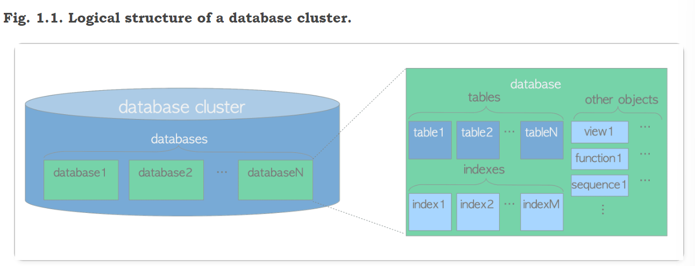

所有的数据对象都由OIDs(object identifiers)唯一标识，根据不同的对象类型存储在catalog中。比如数据库的oid存储在pg_database中，而表，索引等的oid存储在pg_class中。

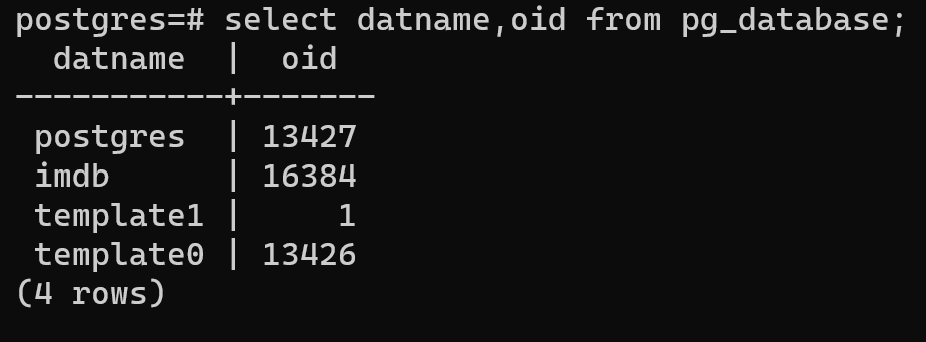

## 1.2. Physical Structure of Database Cluster

一个数据库集群对应一个基目录，而initdb命令可以在指定目录下新建一个数据库集群；这个目录通常在PGDATA下，但也不是强制的。

> pg_ctl -D ~/imdb initdb

如下图，我们指定目录新建了一个集群，由于pg独特的用户权限管理模式，这个数据库集群由ubuntu中的用户拥有，如果这个用户没有pg server的权限，这个集群是无法启动的。在创建时，自动设置了比如buffer大小等配置信息。进入testDB目录后可以看到很多配置文件。

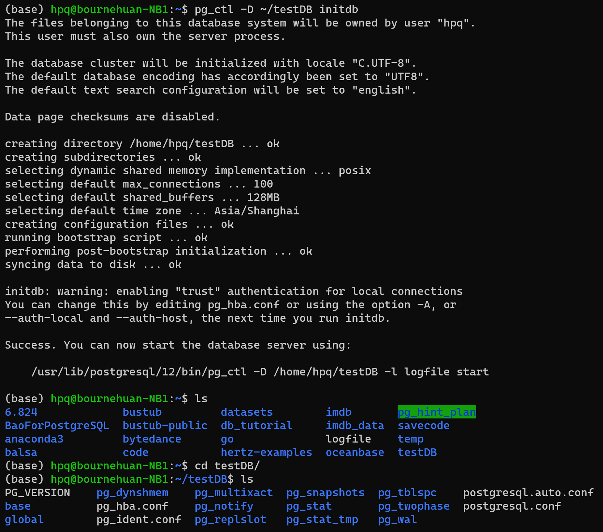

查看PGDATA在哪：

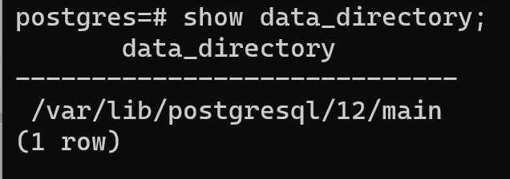

只有postgres用户可以进入该目录


集群的目录结构如下所示，每个数据库存储在base目录下，以oid作为子目录名：


### 1.2.1. Layout of a Database Cluster

**table 1.1: Layout of files and subdirectories under the base directory (From the official document)**

| files                | description                                                  |
| :------------------- | :----------------------------------------------------------- |
| PG_VERSION           | A file containing the major version number of PostgreSQL     |
| pg_hba.conf          | A file to control PosgreSQL's client authentication          |
| pg_ident.conf        | A file to control PostgreSQL's user name mapping             |
| postgresql.conf      | A file to set configuration parameters                       |
| postgresql.auto.conf | A file used for storing configuration parameters that are set in ALTER SYSTEM (version 9.4 or later) |
| postmaster.opts      | A file recording the command line options the server was last started with |

| subdirectories                    | description                                                  |
| :-------------------------------- | :----------------------------------------------------------- |
| base/                             | Subdirectory containing per-database subdirectories.         |
| global/                           | Subdirectory containing cluster-wide tables, such as pg_database and pg_control. |
| pg_commit_ts/                     | Subdirectory containing transaction commit timestamp data. Version 9.5 or later. |
| pg_clog/ (Version 9.6 or earlier) | Subdirectory containing transaction commit state data. It is renamed to *pg_xact* in Version 10. CLOG will be described in [Section 5.4](https://www.interdb.jp/pg/pgsql05.html#_5.4.). |
| pg_dynshmem/                      | Subdirectory containing files used by the dynamic shared memory subsystem. Version 9.4 or later. |
| pg_logical/                       | Subdirectory containing status data for logical decoding. Version 9.4 or later. |
| pg_multixact/                     | Subdirectory containing multitransaction status data (used for shared row locks) |
| pg_notify/                        | Subdirectory containing LISTEN/NOTIFY status data            |
| pg_repslot/                       | Subdirectory containing [replication slot](http://www.postgresql.org/docs/current/static/warm-standby.html#STREAMING-REPLICATION-SLOTS) data. Version 9.4 or later. |
| pg_serial/                        | Subdirectory containing information about committed serializable transactions (version 9.1 or later) |
| pg_snapshots/                     | Subdirectory containing exported snapshots (version 9.2 or later). The PostgreSQL's function pg_export_snapshot creates a snapshot information file in this subdirectory. |
| pg_stat/                          | Subdirectory containing permanent files for the statistics subsystem. |
| pg_stat_tmp/                      | Subdirectory containing temporary files for the statistics subsystem. |
| pg_subtrans/                      | Subdirectory containing subtransaction status data           |
| pg_tblspc/                        | Subdirectory containing symbolic links to tablespaces        |
| pg_twophase/                      | Subdirectory containing state files for prepared transactions |
| pg_wal/ (Version 10 or later)     | Subdirectory containing WAL (Write Ahead Logging) segment files. It is renamed from *pg_xlog* in Version 10. |
| pg_xact/ (Version 10 or later)    | Subdirectory containing transaction commit state data. It is renamed from *pg_clog* in Version 10. CLOG will be described in [Section 5.4](https://www.interdb.jp/pg/pgsql05.html#_5.4.). |
| pg_xlog/ (Version 9.6 or earlier) | Subdirectory containing WAL (Write Ahead Logging) segment files. It is renamed to *pg_wal* in Version 10. |

### 1.2.2. Layout of Databases

一个数据库就是base文件夹下的一个子文件夹，文件夹名为数据库的OID

### 1.2.3. Layout of Files Associated with Tables and Indexes

数据库下每个表或者索引（大小小于1GB）时以单独文件存储在对应的数据库文件夹下（base文件夹下），以表的OID标识；通常这些数据文件由relfilenode管理。表的OID和relfilenode一般情况下是一致的，除非表发生了改动（TRUNCATE, REINDEX）。

如下图，imdb数据库的OID是16384，表name_basics的OID是16385，和其relfilenode一致。

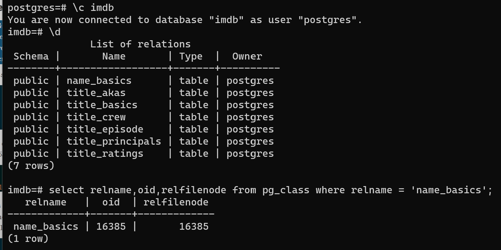

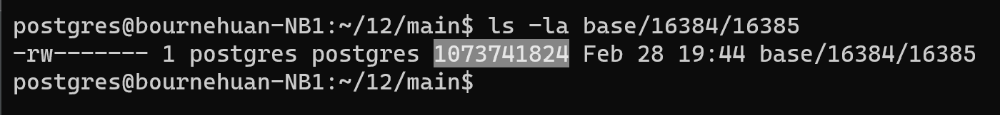

表对应的relfilenode会在一些命令执行后发生改变，比如TRUNCATE, REINDEX, CLUSTER等。这些操作会删除原有的数据文件并重新分配一个。

还可以通过一下方式查找表数据存储位置：


如果表数据超过1GB（这个最大值可以配置），会新增relfilenode.1,.2以此类推，比如下图

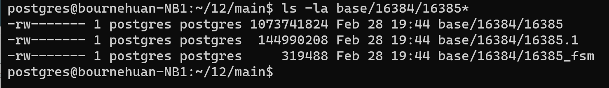

在数据文件夹下可以看到每个表有两个关联文件_fsm和__vm，他们分别对应的是**free space map** 和 **visibility map**，存储表的剩余空间大小以及页的可视信息。索引只有**free space map** 一项。


### 1.2.4. Tablespaces

Tablespaces自8.0版本引入

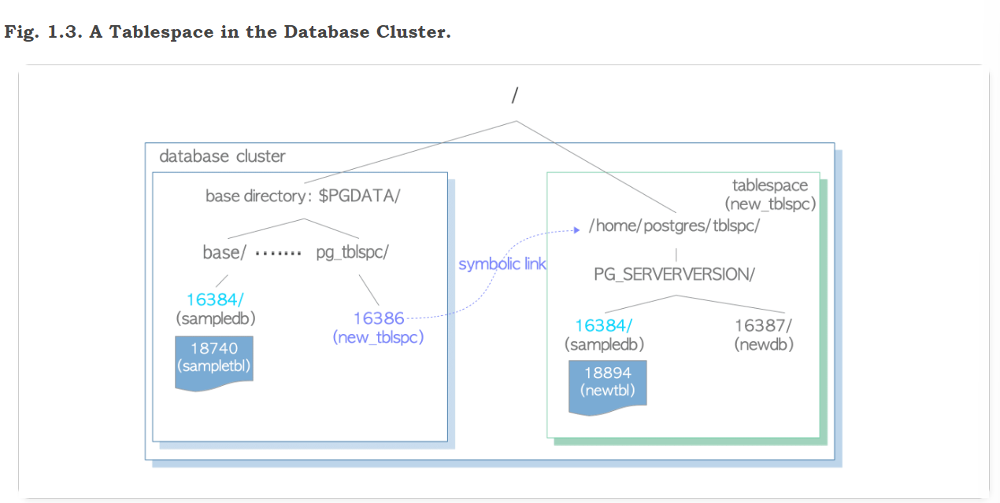

A tablespace is created under the directory specified when you issue [CREATE TABLESPACE](http://www.postgresql.org/docs/current/static/sql-createtablespace.html) statement, and under that directory, the version-specific subdirectory (e.g., PG_14_202011044) will be created. The naming method for version-specific one is shown below.

```sh
PG _ 'Major version' _ 'Catalogue version number'
```

For example, if you create a tablespace *'new_tblspc'* at *'/home/postgres/tblspc'*, whose oid is 16386, a subdirectory such as *'PG_14_202011044'* would be created under the tablespace.

```sh
$ ls -l /home/postgres/tblspc/
total 4
drwx------ 2 postgres postgres 4096 Apr 21 10:08 PG_14_202011044
```

The tablespace directory is addressed by a symbolic link from the *pg_tblspc* subdirectory, and the link name is the same as the OID value of tablespace.

```shell
$ ls -l $PGDATA/pg_tblspc/
total 0
lrwxrwxrwx 1 postgres postgres 21 Apr 21 10:08 16386 -> /home/postgres/tblspc
```

If you create a new database (OID is 16387) under the tablespace, its directory is created under the version-specific subdirectory.

```shell
$ ls -l /home/postgres/tblspc/PG_14_202011044/
total 4
drwx------ 2 postgres postgres 4096 Apr 21 10:10 16387
```

If you create a new table which belongs to the database created under the base directory, first, the new directory, whose name is the same as the existing database OID, is created under the version specific subdirectory, and then the new table file is placed under the created directory.

```sql
sampledb=# CREATE TABLE newtbl (.....) TABLESPACE new_tblspc;

sampledb=# SELECT pg_relation_filepath('newtbl');
             pg_relation_filepath             
---------------------------------------------
 pg_tblspc/16386/PG_14_202011044/16384/18894
```

## 1.3. Internal Layout of a Heap Table File

数据文件是分页（块）的，页面大小默认值为8KB。页面可以由索引或者堆组织，本节只介绍堆组织。

如下图所示，页面包含三种数据：

1. heap tuple(s)：真正的数据存储，从页面**尾部**开始存放
2. line pointer(s)：4字节的指针，指向对应的heap tuple，也称为item pointer。标号从1开始组成一个指针数组，标号也称为offset number，每当新元组插入页面时，新的line pointer也添加进该数组。
3. header data：包含页面相关信息
   - *pd_lsn* – This variable stores the LSN of XLOG record written by the last change of this page. It is an 8-byte unsigned integer, related to the WAL (Write-Ahead Logging) mechanism. The details are described in [Chapter 9](https://www.interdb.jp/pg/pgsql09.html#_9.1.2.).
   - *pd_checksum* – This variable stores the checksum value of this page. (Note that this variable is supported in version 9.3 or later; in earlier versions, this part had stored the timelineId of the page.)
   - *pd_lower, pd_upper* – pd_lower points to **the end of line pointers**, and pd_upper to **the beginning of the newest heap tuple**.
   - *pd_special* – This variable is for indexes. In the page within tables, it points to the end of the page. (In the page within indexes, it points to the beginning of special space which is the data area held only by indexes and contains the particular data according to the kind of index types such as B-tree, GiST, GiN, etc.)


唯一确定一个tuple：TID, 由block number确定页，再由offset number确定指向元组的line poiner。

上图这种类型的页称为slotted page，line pointer称为slot array

## 1.4. The Methods of Writing and Reading Tuples

### 1.4.1. Writing Heap Tuples

Suppose a table composed of one page which contains just one heap tuple. The pd_lower of this page points to the first line pointer, and both the line pointer and the pd_upper point to the first heap tuple. See Fig. 1.5(a).

When the second tuple is inserted, it is placed after the first one. The second line pointer is pushed onto the first one, and it points to the second tuple. The pd_lower changes to point to the second line pointer, and the pd_upper to the second heap tuple. See Fig. 1.5(b). Other header data within this page (e.g., pd_lsn, pg_checksum, pg_flag) are also rewritten to appropriate values; more details are described in [Section 5.3](https://www.interdb.jp/pg/pgsql05.html#_5.3.) and [Chapter 9](https://www.interdb.jp/pg/pgsql09.html).


### 1.4.2. Reading Heap Tuples

对Mysql而言，表是由主键（聚集）索引组织的，最终回到主键索引读取数据；而PG的索引类似Mysql中的二级索引，只负责搜索工作，叶子结点存储的value是TID，最终回到heap file中读取元组。

Two typical access methods, sequential scan and B-tree index scan, are outlined here:

- **Sequential scan** – All tuples in all pages are sequentially read by scanning all line pointers in each page. See Fig. 1.6(a).
- **B-tree index scan** – An index file contains index tuples, each of which is composed of **an index key and a TID pointing to the target heap tuple**. If the index tuple with the key that you are looking for has been found, PostgreSQL reads the desired heap tuple using the obtained TID value. (The description of the way to find the index tuples in B-tree index is not explained here as it is very common and the space here is limited. See the relevant materials.) For example, in Fig. 1.6(b), TID value of the obtained index tuple is ‘(block = 7, Offset = 2)’. It means that the target heap tuple is 2nd tuple in the 7th page within the table, so PostgreSQL can read the desired heap tuple without unnecessary scanning in the pages.


# Chapter 2  Process and Memory Architecture

## 2.1. Process Architecture

PG是多进程，C/S架构，一个Postgresql Server管理一个数据库集合，该server由多进程组成：

- A **postgres server process** is a parent of all processes related to a database cluster management.
- Each **backend process** handles all queries and statements issued by a connected client.
- Various **background processes** perform processes of each feature (e.g., VACUUM and CHECKPOINT processes) for database management.
- In the **replication associated processes**, they perform the streaming replication. The details are described in [Chapter 11](https://www.interdb.jp/pg/pgsql11.html).
- In the **background worker process** supported from version 9.3, it can perform any processing implemented by users. As not going into detail here, refer to the [official document](http://www.postgresql.org/docs/current/static/bgworker.html).


下面介绍三类进程：

### 2.1.1. Postgres Server Process

又被称为postmaster，当使用pg_ctl start命令后，该进程启动。启动后，在内存申请shared memory，然后启动各类background process，等待客户端的连接。客户端连接后，启动backend process来处理客户端请求。

该进程默认监听5432端口，然而一台主机上可能有多个server运行，因此不同的server必须监听不同的端口，这可以通过修改pg配置文件达到。

### 2.1.2. Backend Processes

又称为postgres，由postmaster启动，负责处理client的请求。

该线程只能处理一个数据库，因此在连接到server时必须指定数据库

如果client频繁的连接和断连，server不断地需要创建该线程造成性能下降，一般通过连接池来弥补。

### 2.1.3. Background Processes

| process                    | description                                                  | reference                                                    |
| :------------------------- | :----------------------------------------------------------- | :----------------------------------------------------------- |
| background writer          | In this process, dirty pages on the shared buffer pool are written to a persistent storage (e.g., HDD, SSD) on a **regular basis gradually**. (In version 9.1 or earlier, it was also responsible for checkpoint process.) | [Section 8.6](https://www.interdb.jp/pg/pgsql08.html#_8.6.)  |
| checkpointer               | In this process in version 9.2 or later, checkpoint process is performed. | [Section 8.6](https://www.interdb.jp/pg/pgsql08.html#_8.6.), [Section 9.7](https://www.interdb.jp/pg/pgsql09.html#_9.7.) |
| autovacuum launcher        | The autovacuum-worker processes are invoked for vacuum process periodically. (More precisely, it requests to create the autovacuum workers to the postgres server.) | [Section 6.5](https://www.interdb.jp/pg/pgsql06.html#_6.5.)  |
| WAL writer                 | This process writes and flushes periodically the WAL data on the WAL buffer to persistent storage. | [Section 9.9](https://www.interdb.jp/pg/pgsql09.html#_9.9.)  |
| statistics collector       | In this process, statistics information such as for pg_stat_activity and for pg_stat_database, etc. is collected. |                                                              |
| logging collector (logger) | This process writes error messages into log files.           |                                                              |
| archiver                   | In this process, archiving logging is executed.              | [Section 9.10](https://www.interdb.jp/pg/pgsql09.html#_9.10.) |

如下图，PostgreSQL主进程的PID为745，其下子进程包括一个backend process(PID = 991)以及6个background process，PID从747-752。

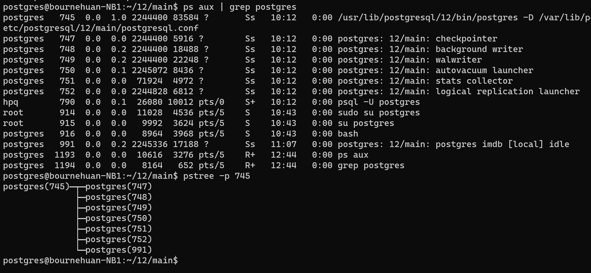

## 2.2. Memory Architecture

Memory architecture in PostgreSQL can be classified into two broad categories:

- Local memory area – allocated by each backend process for its own use.
- Shared memory area – used by all processes of a PostgreSQL server.

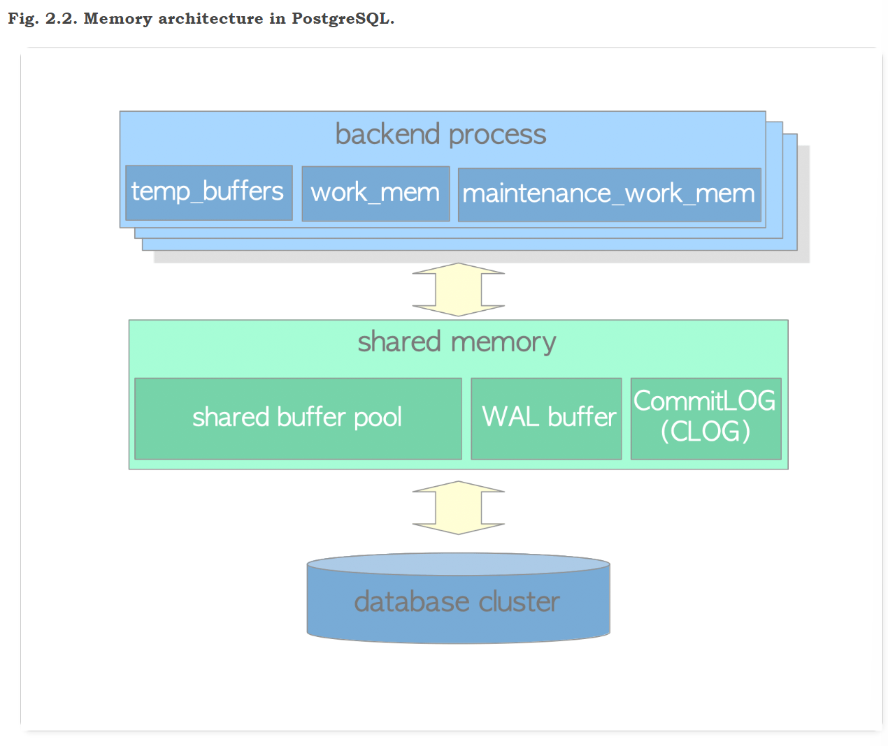

### 2.2.1. Local Memory Area

Each backend process allocates a local memory area for query processing; each area is divided into several sub-areas – whose sizes are either fixed or variable. Table 2.2 shows a list of the major sub-areas. The details will be described in the following chapters.

| sub-area             | description                                                  | reference                                                   |
| :------------------- | :----------------------------------------------------------- | :---------------------------------------------------------- |
| work_mem             | Executor uses this area for sorting tuples by ORDER BY and DISTINCT operations, and for joining tables by merge-join and hash-join operations. | [Chapter 3](https://www.interdb.jp/pg/pgsql03.html)         |
| maintenance_work_mem | Some kinds of maintenance operations (e.g., VACUUM, REINDEX) use this area. | [Section 6.1](https://www.interdb.jp/pg/pgsql06.html#_6.1.) |
| temp_buffers         | Executor uses this area for storing temporary tables.        |                                                             |

### 2.2.2. Shared Memory Area

A shared memory area is allocated by a PostgreSQL server when it starts up. This area is also divided into several fix sized sub-areas. Table 2.3 shows a list of the major sub-areas. The details will be described in the following chapters.

| sub-area           | description                                                  | reference                                                   |
| :----------------- | :----------------------------------------------------------- | :---------------------------------------------------------- |
| shared buffer pool | PostgreSQL loads pages within tables and indexes from a persistent storage to here, and operates them directly. | [Chapter 8](https://www.interdb.jp/pg/pgsql08.html)         |
| WAL buffer         | To ensure that no data has been lost by server failures, PostgreSQL supports the WAL mechanism. WAL data (also referred to as XLOG records) are transaction log in PostgreSQL; and WAL buffer is a buffering area of the WAL data before writing to a persistent storage. | [Chapter 9](https://www.interdb.jp/pg/pgsql09.html)         |
| commit log         | Commit Log(CLOG) keeps the states of all transactions (e.g., in_progress,committed,aborted) for Concurrency Control (CC) mechanism. | [Section 5.4](https://www.interdb.jp/pg/pgsql05.html#_5.4.) |

In addition to them, PostgreSQL allocates several areas as shown below:

- Sub-areas for the various access control mechanisms. (e.g., semaphores, lightweight locks, shared and exclusive locks, etc)
- Sub-areas for the various background processes, such as checkpointer and autovacuum.
- Sub-areas for transaction processing such as save-point and two-phase-commit.

and others.


# Chapter 3  Query Processing

## 3.1. Overview

1. Parser
2. The parser generates a parse tree from an SQL statement in plain text.

3. Analyzer/Analyser
4. The analyzer/analyser carries out a semantic analysis of a parse tree and generates a query tree.

5. Rewriter
6. The rewriter transforms a query tree using the rules stored in the [rule system](http://www.postgresql.org/docs/current/static/rules.html) if such rules exist.

7. Planner
8. The planner generates the plan tree that can most effectively be executed from the query tree.

9. Executor
10. The executor executes the query via accessing the tables and indexes in the order that was created by the plan tree.

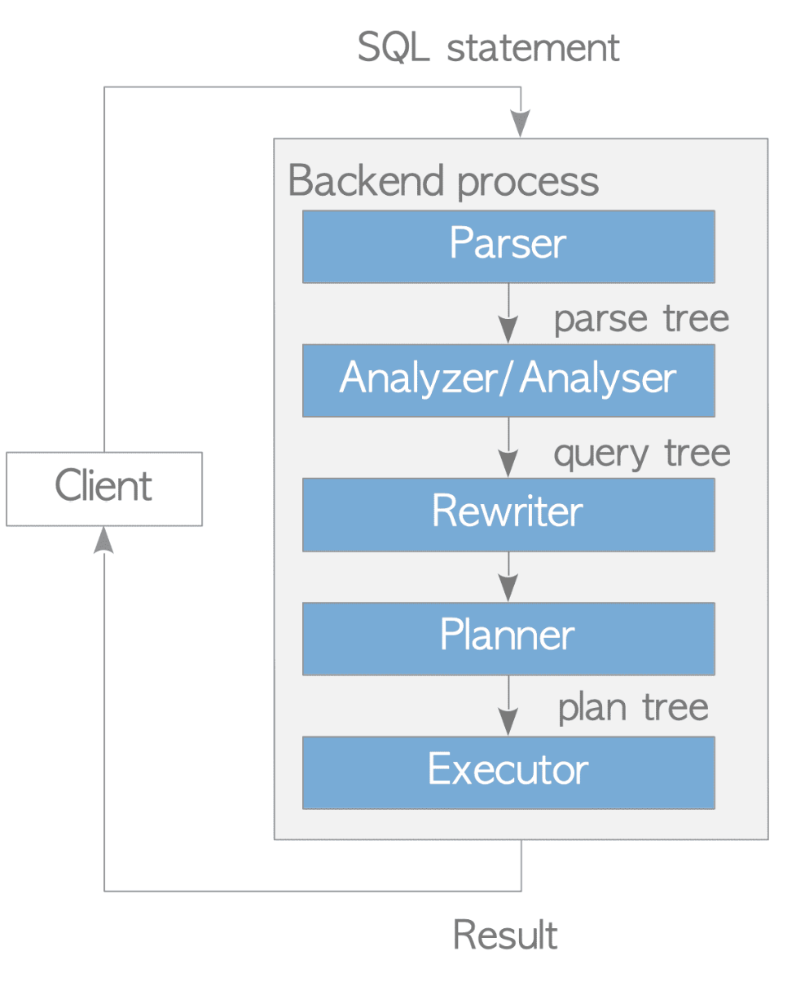

### 3.1.1. Parser

输入sql，进行词法分析

输出的解析树root节点是SelectStmt类型

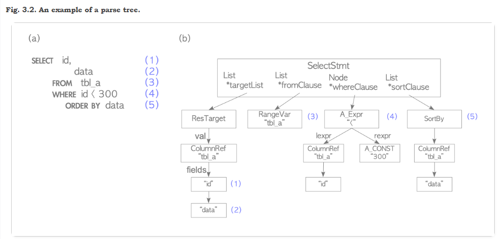

定义在文件：https://github.com/postgres/postgres/blob/master/src/include/nodes/parsenodes.h中

```c++
typedef struct SelectStmt
{
	NodeTag		type;
/*
 * These fields are used only in "leaf" SelectStmts.
 */
List	   *distinctClause; /* NULL, list of DISTINCT ON exprs, or
							 * lcons(NIL,NIL) for all (SELECT DISTINCT) */
IntoClause *intoClause;		/* target for SELECT INTO */
List	   *targetList;		/* the target list (of ResTarget) */
List	   *fromClause;		/* the FROM clause */
Node	   *whereClause;	/* WHERE qualification */
List	   *groupClause;	/* GROUP BY clauses */
bool		groupDistinct;	/* Is this GROUP BY DISTINCT? */
Node	   *havingClause;	/* HAVING conditional-expression */
List	   *windowClause;	/* WINDOW window_name AS (...), ... */

/*
 * In a "leaf" node representing a VALUES list, the above fields are all
 * null, and instead this field is set.  Note that the elements of the
 * sublists are just expressions, without ResTarget decoration. Also note
 * that a list element can be DEFAULT (represented as a SetToDefault
 * node), regardless of the context of the VALUES list. It's up to parse
 * analysis to reject that where not valid.
 */
List	   *valuesLists;	/* untransformed list of expression lists */

/*
 * These fields are used in both "leaf" SelectStmts and upper-level
 * SelectStmts.
 */
List	   *sortClause;		/* sort clause (a list of SortBy's) */
Node	   *limitOffset;	/* # of result tuples to skip */
Node	   *limitCount;		/* # of result tuples to return */
LimitOption limitOption;	/* limit type */
List	   *lockingClause;	/* FOR UPDATE (list of LockingClause's) */
WithClause *withClause;		/* WITH clause */

/*
 * These fields are used only in upper-level SelectStmts.
 */
SetOperation op;			/* type of set op */
bool		all;			/* ALL specified? */
struct SelectStmt *larg;	/* left child */
struct SelectStmt *rarg;	/* right child */
/* Eventually add fields for CORRESPONDING spec here */
} SelectStmt;
```
需要注意的是，parser阶段只进行分词，检查句法，即使query中出现不存在的表这种语义错误也不会报错，这是由analyzer完成的。

### 3.1.2. Analyzer/Analyser

进行分词后，Analyzer对parse tree进行语法分析，生成查询树

该树的根节点是Query结构

```sql
SELECT id, data FROM tbl_a WHERE id < 300 ORDER BY data;
```


- targetList是query返回列的集合，如果查询使用了*，analyzer会转换为所有列添加到这个部分中

- rtable也即range table是query中所有出现的关系表。对于select语句而言，就是出现在FROM字段后的所有表

- jointree存储FROM clause和WHERE clause

  > The query's join tree shows the structure of the `FROM` clause. For a simple query like `SELECT ... FROM a, b, c`, the join tree is just a list of the `FROM` items, because we are allowed to join them in any order. But when `JOIN` expressions, particularly outer joins, are used, we have to join in the order shown by the joins. In that case, the join tree shows the structure of the `JOIN` expressions. The restrictions associated with particular `JOIN` clauses (from `ON` or `USING` expressions) are stored as qualification expressions attached to those join-tree nodes. It turns out to be convenient to store the top-level `WHERE` expression as a qualification attached to the top-level join-tree item, too. So really the join tree represents both the `FROM` and `WHERE` clauses of a `SELECT`.

- sortClause是SortGroupClause的列表

更多查询树信息，见http://www.postgresql.org/docs/current/static/querytree.html

### 3.1.3. Rewriter

根据pg_rules系统改写查询树

### 3.1.4. Planner and Executor

Planner根据改写后的查询树生成最好的（理想化）的执行树，然后由executor负责执行

pg的planner是完全基于CBO的，没有支持rule-based以及hint，当然pg_hint是一个可选的插件

> PostgreSQL does not support the planner hints in SQL, and it will not be supported forever. If you want to use hints in your queries, the extension referred to *pg_hint_plan* will be worth considering. Refer to the [official site](http://pghintplan.osdn.jp/pg_hint_plan.html) in detail.

```sql
testdb=# EXPLAIN SELECT * FROM tbl_a WHERE id < 300 ORDER BY data;
                          QUERY PLAN                           
---------------------------------------------------------------

 Sort  (cost=182.34..183.09 rows=300 width=8)
   Sort Key: data
   ->  Seq Scan on tbl_a  (cost=0.00..170.00 rows=300 width=8)
         Filter: (id < 300)
(4 rows)
```


plan tree由plan node组成

> The executor reads and writes tables and indexes in the database cluster via the buffer manager described in [Chapter 8](https://www.interdb.jp/pg/pgsql08.html). When processing a query, the executor uses some memory areas, such as temp_buffers and work_mem, allocated in advance and creates temporary files if necessary.

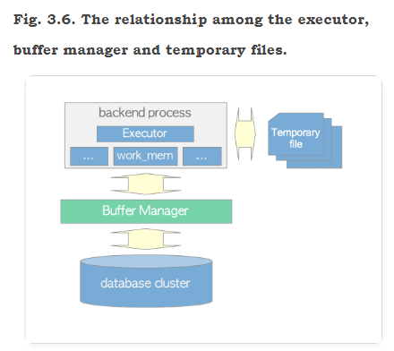

## 3.2. Cost Estimation in Single-Table Query

PG的Planner完全是基于CBO的，位于文件[postgres/costsize.c at master · postgres/postgres (github.com)](https://github.com/postgres/postgres/blob/master/src/backend/optimizer/path/costsize.c)中，里面有大量的预定义Magic factor，因此CBO完全是一个相对的数值。executor所有的操作都有对应的计算开销函数，比如顺序扫描对应cost_seqscan函数，索引扫描对应cost_index()函数等等。

下面是costsize.c文件开头的注释：

path cost是基于一些基础参数计算的：

 * seq_page_cost		       Cost of a sequential page fetch
 * random_page_cost	   Cost of a non-sequential page fetch
 * cpu_tuple_cost		       Cost of typical CPU time to process a tuple
 * cpu_index_tuple_cost   Cost of typical CPU time to process an index tuple
 * cpu_operator_cost	    Cost of CPU time to execute an operator or function
 * parallel_tuple_cost        Cost of CPU time to pass a tuple from worker to leader backend
 * parallel_setup_cost       Cost of setting up shared memory for parallelism

一些设计方案：

1. pg开发者认为内核通常会进行一些预取（提前读）操作来优化，在这种假设下，连续页面读取开销seq_page_cost要比随机页面读取random_page_cost要小（例外：如果数据库中的数据能完全缓存在内存，这两者应该没有区别，该设置为一样的开销）

2. 在这个文件中，开发者还对缓存页面数量进行了一个粗略的估计（这里的缓存包括Pg的buffer pool缓存NBuffers以及系统级别的disk-cache缓存），记录在参数effective_cache_size中。
3. 这些magic factor都是常量，很难有非常有效的估计，只能说尽可能让cost相对准确。用户可以修改这些factor，以免在一些特殊情况下planner的表现非常差（比如一些CPU和硬盘性能与预设factor完全不对等的情况）
4. seq_page_cost and random_page_cost can also be overridden for an individual tablespace, in case some data is on a fast disk and other data is on a slow disk.  Per-tablespace overrides never apply to temporary work files such as an external sort or a materialize node that overflows work_mem. 

对于每个path，分别计算了两种开销：

 * total_cost: total estimated cost to fetch all tuples
 * startup_cost: cost that is expended before first tuple is fetched. For example, the start-up cost of the index scan node is the cost to **read index pages** to access the first tuple in the target table.

在某些情景下，比如LIMIT查询中，最终并不需要返回所有取得的元组，这种只获取部分返回结果的开销计算公式如下：

> actual_cost = startup_cost + (total_cost - startup_cost) * tuples_to_fetch / path->rows;

这个公式对于所有path都是成立的，一个表的row count（所有LIMIT结点以下的plan node中的plan_rows都不会受LIMIT的影响）不受影响，LIMIT在plan node的最上层处理。

注：需考虑path->rows=0时的division-by-zero问题

> For largely historical reasons, **most of the routines in this module use the passed result Path only to store their results (rows, startup_cost and total_cost) into.**  All the input data they need is passed as separate parameters, even though much of it could be extracted from the Path. An exception is made for the cost_XXXjoin() routines, which expect all the other fields of the passed XXXPath to be filled in, and similarly cost_index() assumes the passed IndexPath is valid except for its output values.

-----------------------------------------------------------------------代码注解结束-------------------------------------------------------------------------------------------

下面对cost进行一些测试，测试环境如下


explain命令会给出两个cost，如下图的0.00和145.00分别是start-up 和 total costs


### 3.2.1. Sequential Scan

cost_seqscan()函数负责顺序扫描的开销计算

In the sequential scan, the start-up cost is equal to 0, and the run cost is defined by the following equation:

> run cost = cpu run cost + disk run cost = (cpu_tuple_cost + cpu_operator_cost) × N~tuple~ + seq_page_cost × N~page~

 [seq_page_cost](https://www.postgresql.org/docs/current/static/runtime-config-query.html#GUC-SEQ-PAGE-COST), [cpu_tuple_cost](https://www.postgresql.org/docs/current/static/runtime-config-query.html#GUC-CPU-TUPLE-COST) 和 [cpu_operator_cost](https://www.postgresql.org/docs/current/static/runtime-config-query.html#GUC-CPU-OPERATOR-COST) 在postgresql.conf中设置, 默认值分别是 *1.0*, *0.01* 和 *0.0025*。 N~tuple~ 和 N~page~ 分别是表中所有的元组数和页数，可以通过如下命令查看：

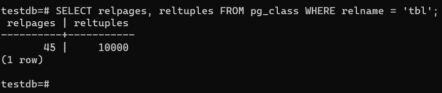

因此，run cost=(0.01+0.0025)×10000+1.0×45=170.0，total cost=0.0+170.0=170.


如上图所示，和实际结果吻合。在不同机器上操作时得到的预计结果一模一样，这也说明了CBO存在一定的局限性。

注： filter ‘Filter:(id < 8000)’ 又被称为**table level filter**，这个过滤器只对元组起作用，并不会缩小扫描页的范围。

另外，从run cost的计算可以看出，PG认为所有页都从磁盘读取，并不考虑页是否在shared buffer中。

### 3.2.2. Index Scan

计算函数：cost_index()

再来看一个走索引查询的例子：

```sql
EXPLAIN SELECT id, data FROM tbl WHERE data < 240;
```

相比上一个小于8000的范围，data<240明显有更高的选择度，这个时候优化器一般都会选择走索引了

还是首先来看一下索引页和元组数：N~index,tuple~=10000, N~index,page~=30.

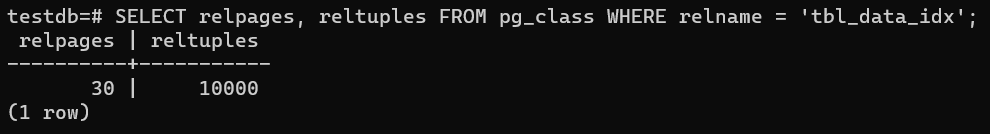

#### 3.2.2.1. Start-Up Cost

PG的索引和Mysql有所不同，可以认为PG的索引都是Mysql中的二级索引（又称为辅助索引），只负责搜索，不存储真实数据的。PG的B树索引叶子结点上的Value是元组的TID，因此真正读取元组前还有索引扫描操作，这就是start-up cost。

> The start-up cost of the index scan is the cost to read the index pages to access to the first tuple in the target table

计算公式：start-up cost = {ceil(log2(N~index,tuple~)) + (H~index~ + 1) × 50} × cpu_operator_cost

其中，H~index~ 是索引树高。

在本例中，N~index~,tuple是10000，H~index~ 是 1，cpu_operator_cost是0.0025 (by default)。

因此，start-up cost = {ceil(log2(10000))+(1+1)×50}×0.0025=0.285。

#### 3.2.2.2. Run Cost

The run cost of the index scan is the sum of the cpu costs and the IO (input/output) costs of **both the table and the index:**

> run cost = (index cpu cost + table cpu cost ) + ( index IO cost + table IO cost).

注：如果是index-only scan，也就是常说的覆盖索引，table cpu cost和table IO cost都不需要考虑了

The first three costs (i.e. index cpu cost, table cpu cost and index IO cost) are shown in below:

index cpu cost = Selectivity × N~index~,tuple × (cpu_index_tuple_cost + qual_op_cost)

table cpu cost = Selectivity × N~tuple~ × cpu_tuple_cost

index IO cost = ceil(Selectivity × N~index~,page) × random_page_cost

[cpu_index_tuple_cost](https://www.postgresql.org/docs/current/static/runtime-config-query.html#GUC-CPU-INDEX-TUPLE-COST) and [random_page_cost](https://www.postgresql.org/docs/current/static/runtime-config-query.html#GUC-RANDOM-PAGE-COST) are set in the postgresql.conf file (the defaults are 0.005 and 4.0, respectively);

qual_op_cost is, roughly speaking, the evaluating cost of the index, and it is shown without much explanation here: qual_op_cost=0.0025 

Selectivity is the proportion of the search range of the index by the specified WHERE clause; it is a floating point number from 0 to 1, and it is described in detail in below. For example, (Selectivity×N~tuple~)means the *number of the table tuples to be read*, (Selectivity×N~index,page~)means the *number of the index pages to be read* and so on.


##### Selectivity


##### Index Correlation


#### 3.2.2.3. Total Cost


### 3.2.3. Sort


# ML For PG

[s-hironobu/pg_plan_inspector: A framework to monitor and improve the performance of PostgreSQL using Machine Learning methods. (github.com)](https://github.com/s-hironobu/pg_plan_inspector)


